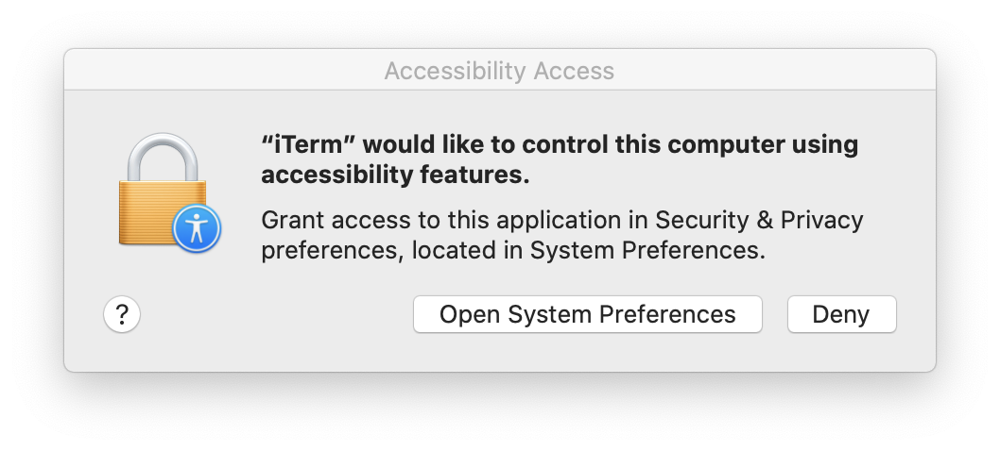

# macOS accessibility client

A Node.JS package, in its current state, only provides the functionality to query whether the running application is a trusted accessibility client, and if not, display the following rather well known prompt:



More functionality may be added in the future. Feel free to open an issue if you think there's something missing.

How to use:

```js
import { applicationIsTrusted, applicationIsTrustedWithPrompt } from 'macos_accessibility_client'

function query_accessibility_permissions() {
    const trusted = applicationIsTrusted();
    if (trusted) {
        print!("Application is totally trusted!");
    } else {
        print!("Application isn't trusted :(");
    }
    return trusted
}

function query_accessibility_permissions_with_prompt() {
    const trusted = applicationIsTrustedWithPrompt();
    if (trusted) {
        print!("Application is totally trusted!");
    } else {
        print!("Application isn't trusted :(");
    }
    return trusted
}
```

Built with [napi-rs](https://napi.rs/) and [macos_accessibility_client](https://github.com/next-slide-please/macos-accessibility-client) crate.

## License

Copyright 2021 Victor Aremu

Licensed under the Apache License, Version 2.0 (the "License");
you may not use this file except in compliance with the License.
You may obtain a copy of the License at

    http://www.apache.org/licenses/LICENSE-2.0

Unless required by applicable law or agreed to in writing, software
distributed under the License is distributed on an "AS IS" BASIS,
WITHOUT WARRANTIES OR CONDITIONS OF ANY KIND, either express or implied.
See the License for the specific language governing permissions and
limitations under the License.
